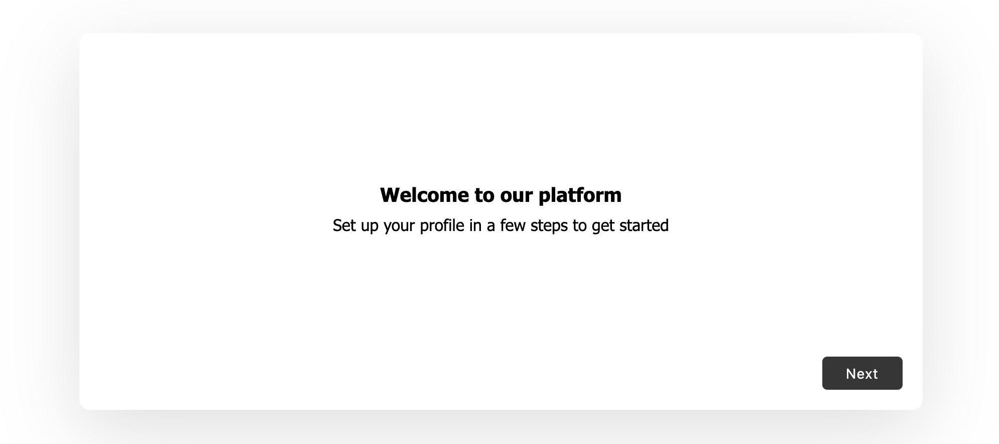

# React Onboarding Pro

Onboarding flow for reducing friction to use the application and improving the workflow

  

- Highly Customizable
- Support for forms in the popups to collect information from user
- Ability to display custom components

## Preview



**[DEMO](https://codesandbox.io/s/react-onboarding-pro-example-y16pn)**

## Install

```
$ npm i -S react-onboarding-pro

or

$ yarn add react-onboarding-pro
```

## Usage

```js

import Onboarding from 'react-onboarding-pro';
import "react-onboarding-pro/build/index.css";

...


// Config for the onboarding flow
const config = {
  steps: [
    {
      title: 'Welcome to the platform',
      description: 'Navigate around the UI to start using it'
    },
  ],
  overlayClose: false // Should enable closing the popup when the overlay is clicked
};

// Display popup
Onboarding(config);

```

## All Configurations

### Text

Show text and description optionally to welcome the user or to give them some additional information to get them started.

```js
{
  title: 'Welcome to the platform',
  description: 'Navigate around the UI to start using it'
}
```

### Display a form

Want to get input from user? embed a form with as many fields as you want.

```js
{
  title: 'Who are you?',
  description: 'Help the community identify you',
  type: 'form', // Have an embedded form
  fields: [
    {
      label: 'First Name',
      name: 'first_name',
      type: 'text',
      placeholder: 'John',
      validation: '[a-zA-Z]' // Regex expression to test for
    },
    {
      label: 'Last Name',
      name: 'last_name',
      type: 'text',
      placeholder: 'Doe',
      validation: ''
    },
  ],
  onSubmit: submitName // Function to be called when the form is submitted
}
```

When the step has been finished and if the field validations are met, the onSubmit function is triggered with the input data as an object.

### Embed a Custom Component

Allows you to show your custom component with your own styling

```js
{
  type: 'component',
  component: CustomComponent
}
```

In case, any custom action (like a POST request) has to be taken when the step is being completed, the custom component needs to provide the onSubmit callback function.

```js
const onSubmitCallback = () => {
  console.log('Custom component action completed');
};

...

setOnSubmit(onSubmitCallback); // This function will be made available in Component's props
```

This can be done from functional component during initialization or from any lifecycles in class based component (except from componentDidUnmount).

In order to enable the onboarding flow's next/finish button, `setButtonState` can be used. Calling it with a true will enable it. This is handy when custom UI validation needs to be added before submitting the form.

## License

[MIT LICENSE](LICENSE)